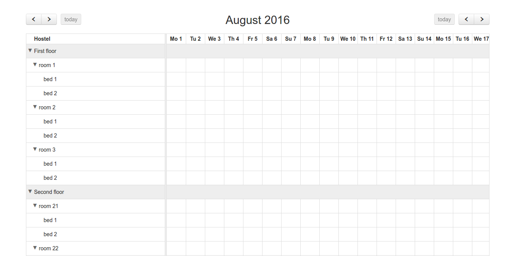
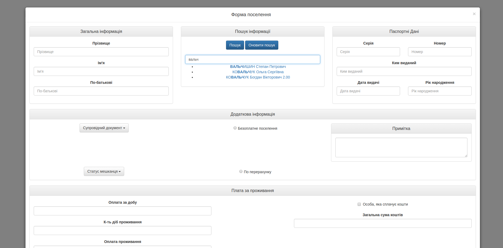

# Hostel Scheduler
> :date: Reserve a room for students with calendar

# Run locally

1. `git clone git@github.com:tneudevteam/hostel-scheduler.git`
2. `cd hostel-scheduler`
3. `npm install`
4. `npm start` - to open Hostel Scheduler in your browser

# Screenshots

